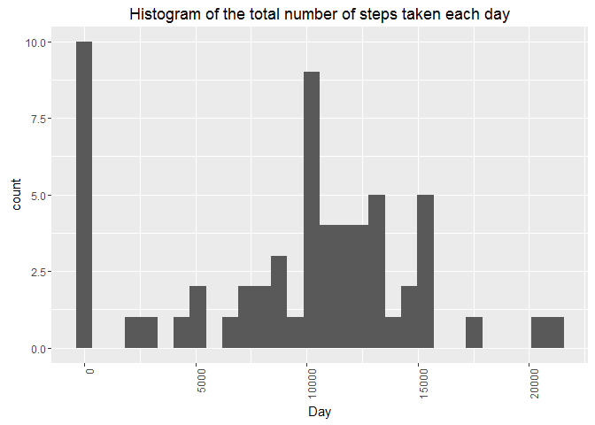
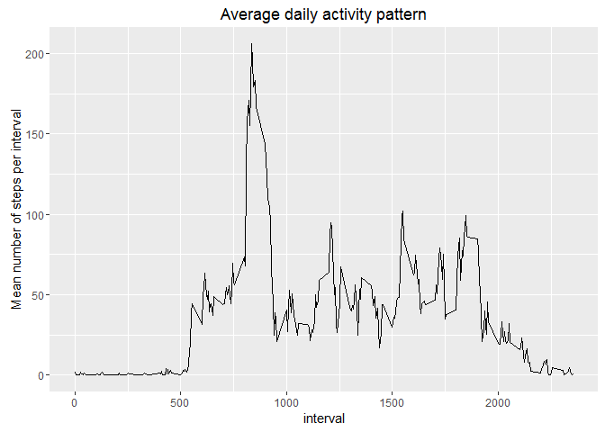
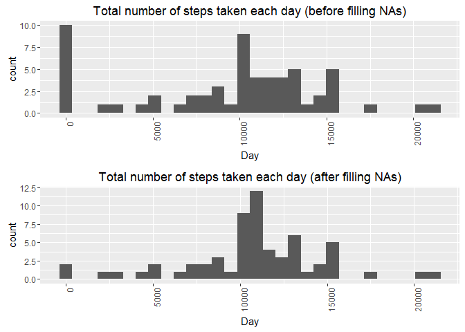
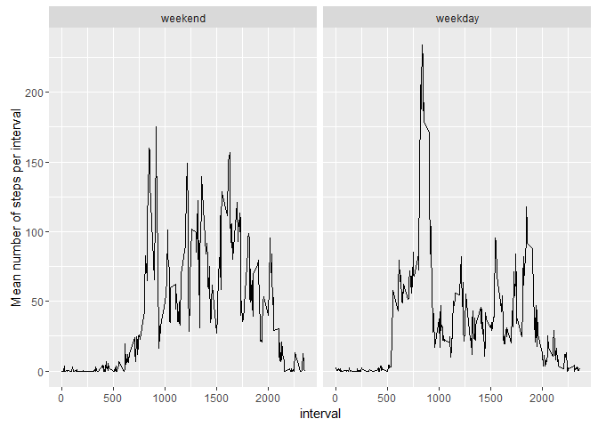

# Reproducible Research: Peer Assessment 1


## Loading and preprocessing the data

```r
#Loading the raw data
activityData <- read.csv("activity.csv",header= TRUE)
#Grouping the data 
ADGroupByDate <- activityData %>% group_by(date)
#Calculating total, mean and median number of steps for the grouped data
ADSummarizedByDate <- as.data.frame(summarise(ADGroupByDate, totalSteps=sum(steps, na.rm = TRUE),meanSteps=mean(steps, na.rm = TRUE),medianSteps=median(as.vector(steps), na.rm = TRUE)))
```

## What is mean total number of steps taken per day?

### Make a histogram of the total number of steps taken each day


```r
#Plotting the histogram
ggplot(ADSummarizedByDate,aes(totalSteps)) + geom_histogram(bins="30")  + xlab("Day") + ggtitle("Histogram of the total number of steps taken each day") + theme(axis.text.x = element_text(angle = 90, hjust = 1))
```

<!-- -->

### Calculate and report the mean and median total number of steps taken per day


```r
meanTotal <- mean(ADSummarizedByDate$totalSteps, na.rm = TRUE)
medianTotal <- median(ADSummarizedByDate$totalSteps, na.rm = TRUE)
```
The mean total number of steps taken per day is 9354.2295082 and the median total number is  10395

## What is the average daily activity pattern?

### Make a time series plot (i.e. type = "l") of the 5-minute interval (x-axis) and the average number of steps taken, averaged across all days (y-axis)


```r
#Grouping the data
ADSummarizedByInterval <- activityData %>% group_by(interval)
#Calculating total, mean and median number of steps for the grouped data
ADSummarizedByInterval <- as.data.frame(summarise(ADSummarizedByInterval, totalSteps=sum(steps, na.rm = TRUE),meanSteps=mean(steps, na.rm = TRUE),medianSteps=median(as.vector(steps), na.rm = TRUE)))
#Time series plot
ggplot(ADSummarizedByInterval,aes(x=interval,y=meanSteps)) + geom_line() + ylab("Mean number of steps per interval") + ggtitle("Average daily activity pattern")
```

<!-- -->

### Which 5-minute interval, on average across all the days in the dataset, contains the maximum number of steps?

```r
maxStepsInterval <- ADSummarizedByInterval[which.max(ADSummarizedByInterval$totalSteps), ]
```

The interval that contains the maximum number of steps is 835 with 10927 steps.

## Imputing missing values

### 1. Calculate and report the total number of missing values in the dataset (i.e. the total number of rows with NAs)

```r
numberOfMissingValues <- sum(is.na(activityData$steps))
```
The total number of missing values in the dataset is 2304.
### 2. Devise a strategy for filling in all of the missing values in the dataset. The strategy does not need to be sophisticated. For example, you could use the mean/median for that day, or the mean for that 5-minute interval, etc.

Each missing value is replaced by the mean number of steps for the current interval along all days. The code is the following:


```r
#Copying original data to a new dataframe
activityDataFilled <- activityData
#Getting position of NAs 
indx <- which(is.na(activityDataFilled$steps))
#Replacing each NA in an interval for the mean value of steps for that given interval
for(i in indx ){
  activityDataFilled$steps[i] <- subset(ADSummarizedByInterval,(interval==activityData$interval[i]))$meanSteps
}
```

### 3. Create a new dataset that is equal to the original dataset but with the missing data filled in.

The code about creates the dataset `activityDataFilled` in which all missing values are replaced by the mean number of steps for that interval.

### 4. Make a histogram of the total number of steps taken each day and Calculate and report the mean and median total number of steps taken per day. 

```r
#Grouping the data
ADFSummarizedByDate <- activityDataFilled %>% group_by(date)
#Calculating total, mean and median number of steps for the grouped data
ADFSummarizedByDate <- as.data.frame(summarise(ADFSummarizedByDate, totalSteps=sum(steps, na.rm = TRUE),meanSteps=mean(steps, na.rm = TRUE),medianSteps=median(as.vector(steps), na.rm = TRUE)))
```


```r
g1 <-ggplot(ADSummarizedByDate,aes(totalSteps)) + geom_histogram(bins=30)  + xlab("Day") + ggtitle("Total number of steps taken each day (before filling NAs)")  + theme(axis.text.x = element_text(angle = 90, hjust = 1))

g2 <-ggplot(ADFSummarizedByDate,aes(totalSteps)) + geom_histogram(bins=30)  + xlab("Day") + ggtitle("Total number of steps taken each day (after filling NAs)")  + theme(axis.text.x = element_text(angle = 90, hjust = 1))

g2
```

<!-- -->

Plotting the two histograms (before and after filling NAs) for the sake of comparison.

<!-- -->

### 5. Do these values differ from the estimates from the first part of the assignment? What is the impact of imputing missing data on the estimates of the total daily number of steps?


```r
meanTotalFilling <- mean(ADFSummarizedByDate$totalSteps, na.rm = TRUE)
medianTotalFilling <- median(ADFSummarizedByDate$totalSteps, na.rm = TRUE)
```
After filling the missing values, the mean total number of steps taken per day is 1.0766189\times 10^{4} and the median total number is  1.0766189\times 10^{4}. Before, they were 9354.2295082 and 10395 respectively. The mean values are the same but the median changes after filling the missing values.


## Are there differences in activity patterns between weekdays and weekends?

To answer this question, need to calculate the mean the number of steps per interval and per week or weekend day. At the end we will have a mean value of steps per interval for weekdays and another for weekends.


### Create a new factor variable in the dataset with two levels -- "weekday" and "weekend" indicating whether a given date is a weekday or weekend day.

###    Make a panel plot containing a time series plot (i.e. type = "l") of the 5-minute interval (x-axis) and the average number of steps taken, averaged across all weekday days or weekend days (y-axis). The plot should look something like the following, which was created using simulated data:


```r
#Factoring the dates
activityData$weekDay <-  as.factor(weekdays(as.Date(activityData$date)))
#Creating a vector with Sunday and Saturday
weekends <- weekdays(as.Date('1970-01-02') +1:2)
#We add a new column with TRUE values for weekends and FALSE for weekdays
activityData$weekend <- factor(activityData$weekDay %in% weekends, 
         levels=c(TRUE, FALSE), labels=c('weekend', 'weekday'))
#Grouping by interval and by the new column weekend         
activityDataByWeekDay <-  activityData %>% group_by(interval,weekend)

#Calculating total, mean and median number of steps for the grouped data
ADFSummarizedByWeekDay <- as.data.frame(summarise(activityDataByWeekDay, totalSteps=sum(steps, na.rm = TRUE),meanSteps=mean(steps, na.rm = TRUE),medianSteps=median(as.vector(steps), na.rm = TRUE)))
# Ploting the values
ggplot(ADFSummarizedByWeekDay,aes(x=interval,y=meanSteps)) + geom_line() + ylab("Mean number of steps per interval") + facet_wrap(~weekend)
```

<!-- -->

It's clear that activity patterns differ on weekends as the activity starts later than during weekdays and it's lower during the morning and higher during the afternoon when compare to weekdays activity.

 
